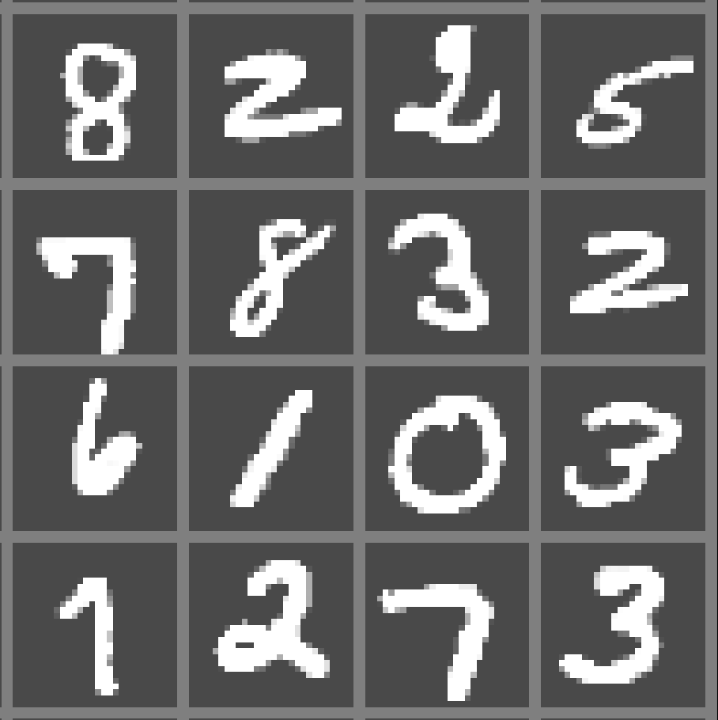
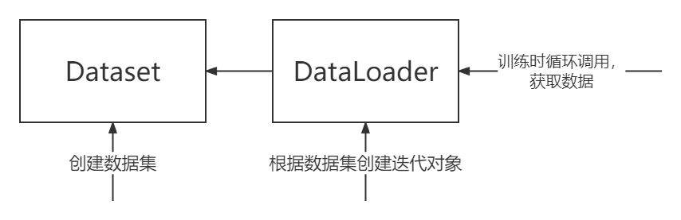
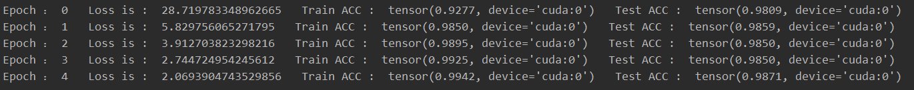
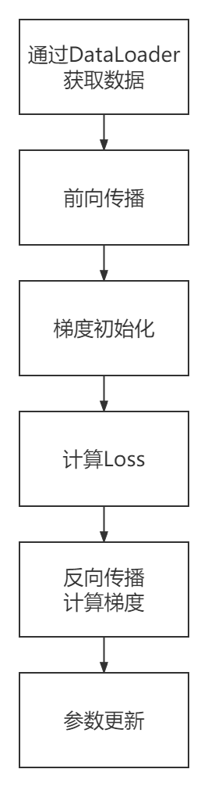

# Pytorch 简单实例

> 小贴士：本节所列举的结构大部分均可以自定义(例如Dataset、损失函数、优化器、网络层等)。由于本节主要讲述一个基础模型的搭建，因此不展开对各个模块的自定义方法进行讲解。


## 1.网络的基础

当我们想使用Pytorch训练出我们的第一个网络时，我们需要完成以下模块：

* 数据集加载
* 模型网络的搭建
* 损失函数与优化器的选择
* 模型训练与测试
* 模型的保存

本节将以MNIST手写数字数据集，训练一个手写数字识别网络。

## 2.MNIST数据集

MNIST数据集全称Mixed National Institute of Standards and Technology database，是由美国国家标准与技术研究所收集并整理的一个大型手写数字数据集。其中包含了一个训练集和一个测试集，训练集包含60000张手写数字图像和其对应的标签，测试集包含10000张手写数字图像和其对应的标签。




在```torchvision```中可以使用```dateset```轻松的下载MNIST数据集。

## 3.数据集的导入

```python
import torch
import torchvision

from torchvision.utils.data import DataLoader
from torchvision import datasets, transforms
```

其中```torchvision.datasets```类提供了常用的数据集，比如```MNIST、COCO、CIFAR10```等。

```python
transform = transforms.Compose([transforms.ToTensor(),
                                transforms.Normalize((0.1307), (0.3081))
                               ])

# 数据集下载
data_train = datasets.MNIST(root="./dataset/mnist/",   # 数据集下载路径
                            transform=transform,       # 预处理操作
                            train=True,                # 训练集还是测试集
                            download=True)             # 是否下载

data_test = datasets.MNIST(root="./dataset/mnist/",
                           transform=transform,
                           train=False,
                           download=True)

# 数据集载入
data_loader_train = DataLoader(dataset=data_train,
                               batch_size=32)          # BatchSize 

data_loader_test = DataLoader(dataset=data_test,
                              batch_size=32)

```

```transforms```是Pytorch中对图像数据的预处理包，包含了多种对图像处理的操作：

```python
transforms.Compose()    # 将多步预处理操作打包

transforms.ToTensor()   # 将PIL Image 或者 numpy.ndarray转换为tensor
transforms.Normalize()  # 图像归一化
transforms.Resize()     # 重置图像大小
```

具体的```transforms```可以参考[transforms官方文档](https://pytorch.org/vision/stable/transforms.html)。


数据集的载入可以理解如下：



```python
torchvision.utils.data.DataLoader(
    	   dataset,                  # Dataset  数据集 
           batch_size = 1,           # int      Batch样本数
           shuffle = Fals,           # bool     迭代时是否打乱数据集
           sampler = None,           # Sampler  取样本策略
           batch_sampler = None,     # Sampler  与sampler类似,每次返回一个batch的index
           num_workers = 0,          # int      处理加载数据进程数
           collate_fn = None,        # Callable 合并样本列表以形成小批量Tensor
           pin_memory = False,       # bool     是否固定到CUDA固定内存
           drop_last = False,        # bool     是否丢弃不足batch_size的数据
           timeout = 0,              # int      等待获取一个batch的时间
           worker_init_fn = None,    # Callable Worker初始化函数
)
```

## 4.网络结构搭建
1998年由*Lecun , Bottou , et al* 在论文 ***Gradient-based learning applied to document recognition***提出了一种用于手写字符识别的卷积神经网络——LeNet-5。除去输入层外，其拥有7层结构：


```python
import torch

import torch.nn as nn
import torch.nn.functional as F
```

在```Pytorch```中一个网络结构要写成一个类并继承```torch.nn.Module```类，在类中我们要实现两个方法的重载：```__init__```用于定义网络的各个层、```forward```实现网络的计算过程。当我们定义```forward```方法后，```backward```将会自动实现自动求导功能。

```python
class LeNet5(nn.Module):
    def __init__(self):
    	super(LeNet5,self).__init__()
    	
        self.conv1    = nn.Conv2d(1,6,kernel_size = 5) # C1层定义
        self.pooling1 = nn.MaxPool2d(kernel_size=2)    # S2层定义
        self.conv2    = nn.Conv2d(6,16,kernel_size = 5)# C3层定义
        self.pooling2 = nn.MaxPool2d(kernel_size=2)    # S4层定义
        
        # 同transforms.Compose()一样
        # 你可以通过nn.Sequential将多层绑定到一起
        self.fc = nn.Sequential(
        			nn.Linear(in_features = 4*4*16,out_feature=120), # C5层定义
            		nn.Linear(in_features = 120,out_feature=84)      # F6层定义
           			nn.Linear(in_features = 84,out_feature=10)       # Output
        )

	def forward(x,self):
        x = self.conv1(x)  # 调用C1层
        x = F.relu(x)      # relu激活层
        x = self.pooling1(x)
        
        x = self.conv2(x)
        x = F.relu(x)
        x = self.pooling2(x)
        
        x = self.fc(x)
        
        return x
```

在```torch.nn```中定义了许多层，继承于```nn.Module```，可以学习其中的参数，本文用到的具体参数如下：

```python
nn.Conv2d(
    in_channels,               # int 输入通道数
    out_channels,              # int 输出通道数
    kernel_size,               # int/(int,int) 卷积核大小
    stride = 1,                # int/(int,int) 步长
    padding = 0,               # int/(int,int) 填充数
    dilation = 1,              # int/(int,int) 卷积核点间距
    groups = 1,                # int 分组卷积
    bias = True,               # bool 是否加入一个可学习偏差
    padding_mode = 'zeros'     # str 卷积模式 'zeros'/'reflect'/'replicate'/'circular'
)

nn.Linear(
	in_features,               # int 输入特征数
    out_features,              # int 输出特征数
    bias = Ture                # bool 是否加入一个可学习偏差
)

nn.MaxPool2d(
	kernel_size,               # int/(int,int) 核大小
    stride=None,               # int/(int,int) 步长
    padding=0,                 # int/(int,int) 填充 
    dilation=1,                # int/(int,int) 一个控制窗口中元素步幅的参数
    return_indices=False,      # bool 是否返回最大值序号
    ceil_mode=False            # bool True->向上取整 False->向下取整
)
```

更多的可以参考[```torch.nn```](https://pytorch.org/docs/stable/nn.html)。

而在```torch.nn.functional```中定义的函数则是一些不需要学习的层，比如激活层(relu,softmax等)。在使用时，这些层只会进行计算，其中的参数并不参与求导学习。更多函数可以参考[```torch.nn.functional```](https://pytorch.org/docs/stable/nn.functional.html)。

## 5.损失函数与优化器的选择

在```torch.nn```中已经预定义了21种损失函数：

```python
nn.L1Loss()
nn.MSELoss()
nn.CrossEntropyLoss()
nn.CTCLoss()
nn.NLLLoss()
nn.PoissonNLLLoss()
nn.GaussianNLLLoss()
nn.KLDivLoss()
nn.BCELoss()
nn.BCEWithLogitsLoss()
nn.MarginRankingLoss()
nn.HingeEmbeddingLoss()
nn.MultiLabelMarginLoss()
nn.HuberLoss()
nn.SmoothL1Loss()
nn.SoftMarginLoss()
nn.MultiLabelSoftMarginLoss()
nn.CosineEmbeddingLoss()
nn.MultiMarginLoss()
nn.TripletMarginLoss()
nn.TripletMarginWithDistanceLoss()
```

具体参数与使用方法本节不便展开，可自行查阅:[Pytorch Loss Function](https://pytorch.org/docs/1.11/nn.html#loss-functions)。

神经网络优化算法可以加快训练过程、提高训练结果。在```torch.optim```中提供了相应的优化方法。

* Adadelta
* Adagrad
* Adam
* AdamW
* SparseAdam
* Adamax
* ASGD
* LBFGS
* NAdam
* RAdam
* RMSprop
* Rprop
* SGD

具体参数可参阅[```torch.optim```](https://pytorch.org/docs/1.11/optim.html)。

在本节中我们选用```nn.CrossEntropyLoss()```作为损失函数，```torch.optim.Adam()```作为优化器。


## 6.网络的训练

```python
# 初始化模型
model = LeNet5()

# GPU相关(如果你只使用CPU请忽略此代码块)
# 本节仅介绍单机单GPU使用
torch.cuda.is_available()      # 查看GPU是否可用
torch.cuda.device_count()      # 查看GPU数量
torch.cuda.current_device()    # 查看当前GPU索引号
torch.cuda.get_device_name(0)  # 查看GPU索引号对应的GPU名称

module = module.cuda()         # 将module移动到当前GPU

device = torch.device("cuda:0"）
module.to(device)              # 将module移动到具体GPU
# 注意！当你使用GPU时，同样需要将数据移动到相同GPU上
# 移动方式同module
                      
# 损失函数与优化器选择
loss_func = torch.nn.CrossEntropyLoss()
optimizer = torch.optim.Adam(modukle.parameters())

# 迭代轮数
epoch_num = 100 

# 模型训练
for epoch in range(epoch_num):
    loss_var = 0.0           # 损失值
    train_correct_num = 0    # 分类正确个数

    for data in data_loader_train:  # 加载数据，返回的是一个batch的数据
        X_train, Y_train = data

        # 前向传播
        outputs = model(X_train)
        _, pred = torch.max(outputs.data, 1)

        # 反向传播
        optimizer.zero_grad()                  # 模型参数梯度初始化为0
        loss = loss_func(outputs, Y_train)     # 计算loss
        loss.backward()                        # 反向传播
        optimizer.step()                       # 更新参数
        
        loss_var += loss.item()
        train_correct_num += torch.sum(pred == Y_train.data)
    
    test_correct_num = 0
    for data in data_loader_test:
        X_test, y_test = data
        outputs = model(X_test)
        _, pred = torch.max(outputs.data, 1)
        test_correct_num += torch.sum(pred == y_test.data)
    
    print("Epoch ：",epoch,
          "  Loss is : ",loss_var, 
          "  Train ACC : ",train_correct_num/len(data_train),
          "  Test ACC : ",test_correct_num / len(data_test)
    )

```
通过调节```epoch_num```你可以选择迭代轮数。



训练的过程如下：



## 7.网络的保存与载入

当你训练好一个模型或者只是对一个模型进行预训练时，就需要将模型的参数进行保存或者加载。

```python

# 保存
torch.save(model.state_dict(), PATH)    # PATH请填写你想要保存的路径

# 加载
model.load_state_dict(torch.load(PATH)) # PATH请填写模型参数的保存路径

```
更多的保存加载方式请参阅[Pytorch 模型保存与加载](https://pytorch123.com/ThirdSection/SaveModel/)。

## 8.参考资料

* [Pytorch Tensforms](https://pytorch.org/vision/stable/transforms.html)
* [MNIST](http://yann.lecun.com/exdb/mnist/)
* [Pytorch DataLoader](https://pytorch.org/docs/stable/data.html)
* [Y. Lecun, L. Bottou, Y. Bengio and P. Haffner, "Gradient-based learning applied to document recognition," in Proceedings of the IEEE, vol. 86, no. 11, pp. 2278-2324, Nov. 1998, doi: 10.1109/5.726791.](https://ieeexplore.ieee.org/document/726791/authors#authors)
* [Pytorch nn](https://pytorch.org/docs/stable/nn.html)
* [Pytorch nn.functional](https://pytorch.org/docs/stable/nn.functional.html)
* [Pytorch Loss Function](https://pytorch.org/docs/1.11/nn.html#loss-functions)
* [Pytorch optim](https://pytorch.org/docs/1.11/optim.html)
* [Pytorch 模型保存与加载](https://pytorch123.com/ThirdSection/SaveModel/)