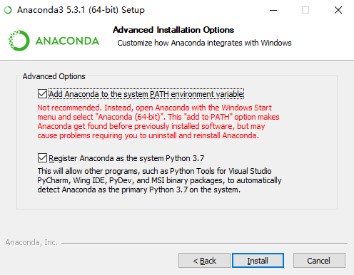
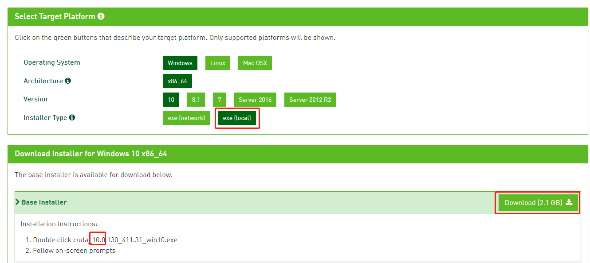
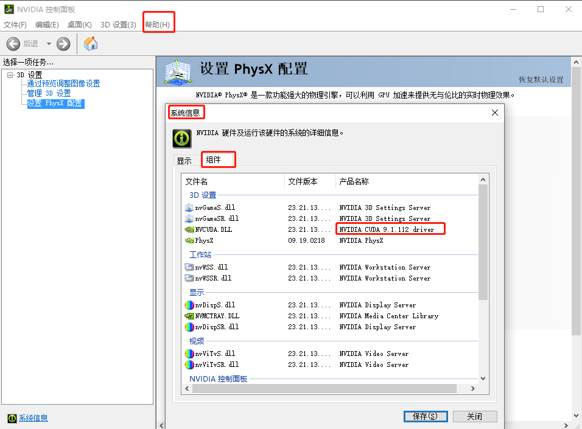

# PyTorch 环境准备
请完整看完本文之后再进行操作，这样可以避免以下环境安装过程中遇到的一些坑。

## 1. 开发环境
<table>
  <thead>
    <tr>
      <th align="center">#</th>
      <th align="center">Tool</th>
      <th align="center">Logo</th>
      <th align="center">Description</th>
    </tr>
  </thead>
  <tbody>
    <tr>
      <td align="center">1</td>
      <td align="center">Anaconda</td>
      <td align="center"><div align="center"></img></div></td>
      <td align="center">开源 Python 发行版</td>
    </tr>
    <tr>
      <td align="center">2</td>
      <td align="center">CUDA</td>
      <td align="center"><div align="center"></img></div></td>
      <td align="center">并行语言计算库</td>
    </tr>
    <tr>
      <td align="center">3</td>
      <td align="center">PyTorch</td>
      <td align="center"><div align="center"></img></div></td>
      <td align="center">深度学习框架</td>
    </tr>
    <tr>
      <td align="center">4</td>
      <td align="center">PyCharm</td>
      <td align="center"><div align="center"></img></div></td>
      <td align="center">Python 开发利器</td>
    </tr>
</table>


## 2. 开始安装
### 2.1 Anaconda
Anaconda 的下载地址：https://repo.anaconda.com/archive/Anaconda3-2019.07-Windows-x86_64.exe

下载完成后，双击运行安装。安装过程中，会提示是否将 `Anaconda` 添加到环境变量，建议**勾选**，方便后面的操作。



安装完成后，在 cmd 窗口执行 `conda list`：

```bash
>conda list
```

可以看到，conda 自带有很多包，包括 Python。

```bash
......
pysocks                   1.7.0                    py37_0    defaults
pytables                  3.4.4            py37he6f6034_0    defaults
pytest                    5.0.1                    py37_0    defaults
pytest-arraydiff          0.2              py37h39e3cac_0    defaults
pytest-astropy            0.4.0                    py37_0    defaults
pytest-doctestplus        0.1.3                    py37_0    defaults
pytest-openfiles          0.3.2                    py37_0    defaults
pytest-remotedata         0.3.2                    py37_0    defaults
python                    3.7.4                h5263a28_0    defaults
python-dateutil           2.8.0                    py37_0    defaults
python-libarchive-c       2.8                     py37_13    defaults
pytz                      2019.2                     py_0    defaults
pywavelets                1.0.0            py37h452e1ab_0    defaults
pywin32                   223              py37hfa6e2cd_1    defaults
......
```

执行 `conda -V` 命令查看 conda 当前版本：

```bash
>conda -V
conda 4.7.11
```

命令成功执行，说明 Anaconda 安装好了。

### 2.2 CUDA
接下来我们安装 CUDA。

**注意**，CUDA 只能运行在 NVIDIA 显卡上，因此，在进行 `DeepLearning` 学习的时候，请确保有一张 NVIDIA 显卡。

我们在装有 NVIDIA 显卡的电脑上安装 NVIDIA 显卡驱动以及统一的并行语言计算库 `CUDA`，通过利用 CUDA 提供的 API，可以很方便地调用计算机硬件资源进行并行计算。

CUDA 的下载地址：https://developer.nvidia.com/cuda-downloads

根据自己本机，选中对应的操作系统，Installer Type 选择 `exe(local)`，下载即可。比如我下载的是 CUDA 10.0：https://developer.nvidia.com/compute/cuda/10.0/Prod/local_installers/cuda_10.0.130_411.31_win10



安装包有点大，2.1 个 G，下载完成后，双击运行进行安装。


CUDA 默认安装在 `C:\Program Files\NVIDIA GPU Computing Toolkit\CUDA` 路径下，安装完成后，把 `C:\Program Files\NVIDIA GPU Computing Toolkit\CUDA\v10.1\bin` 添加到系统环境变量之后，执行 `nvcc -V` 命令，

```bash
>nvcc -V
nvcc: NVIDIA (R) Cuda compiler driver
Copyright (c) 2005-2019 NVIDIA Corporation
Built on Sun_Jul_28_19:12:52_Pacific_Daylight_Time_2019
Cuda compilation tools, release 10.1, V10.1.243
```

以上说明 CUDA 已成功安装。


### 2.3 PyTorch
接下来安装 PyTorch。

到 PyTorch 官网：https://pytorch.org/

目前 PyTorch 最新稳定版本是 `v1.2`，根据本机选择对应的版本，PyTorch 会生成一条命令。比如：

```bash
conda install pytorch torchvision cudatoolkit=10.0 -c pytorch
```

> PyTorch 程序运行时需要特定的 CUDA 版本进行运行环境的支持，比如 PyTorch 1.2 需要使用 CUDA 10.0 版本，若安装 CUDA 10.1 版本，将无法满足需求。

我们在系统中**以管理员身份运行**（重要！） cmd，执行上面的命令进行安装。

第一次安装 pytorch 可能会出现 `CondaHTTPError` 连接失败的报错信息：

```bash
CondaHTTPError: HTTP 000 CONNECTION FAILED for url <https://conda.anaconda.org/pytorch/win-64/pytorch-1.2.0-py3.7_cuda100_cudnn7_1.tar.bz2>
Elapsed: -

An HTTP error occurred when trying to retrieve this URL.
HTTP errors are often intermittent, and a simple retry will get you on your way.

CondaHTTPError: HTTP 000 CONNECTION FAILED for url <https://conda.anaconda.org/pytorch/win-64/torchvision-0.4.0-py37_cu100.tar.bz2>
Elapsed: -

An HTTP error occurred when trying to retrieve this URL.
HTTP errors are often intermittent, and a simple retry will get you on your way.
```

这是因为在 conda 安装好之后，默认的镜像是官方的，由于官方镜像在境外，访问太慢或者不能访问，为了加快访问的速度，可以重新配置为“清华”的镜像。

我们打开系统的 `.condarc` 文件，这是 conda 应用程序的配置文件，在这里可以修改镜像源，我们将文件内容修改为：

```bash
channels:
  - defaults
show_channel_urls: true
default_channels:
  - https://mirrors.tuna.tsinghua.edu.cn/anaconda/pkgs/main
  - https://mirrors.tuna.tsinghua.edu.cn/anaconda/pkgs/r
custom_channels:
  conda-forge: https://mirrors.tuna.tsinghua.edu.cn/anaconda/cloud
  msys2: https://mirrors.tuna.tsinghua.edu.cn/anaconda/cloud
  bioconda: https://mirrors.tuna.tsinghua.edu.cn/anaconda/cloud
  menpo: https://mirrors.tuna.tsinghua.edu.cn/anaconda/cloud
  pytorch: https://mirrors.tuna.tsinghua.edu.cn/anaconda/cloud
```

保存之后，重新执行 PyTorch 的 install 命令，这次应该是能成功了：

```bash
>conda install pytorch torchvision cudatoolkit=10.0 -c pytorch
Solving environment: -
Warning: 8 possible package resolutions (only showing differing packages):
  - https://repo.anaconda.com/pkgs/main::ca-certificates-2018.03.07-0, https://repo.anaconda.com/pkgs/main::certifi-2018.8.24-py37_1, https://repo.anaconda.com/pkgs/main::openssl-1.0.2p-hfa6e2cd_0
  - defaults::ca-certificates-2018.03.07-0, https://repo.anaconda.com/pkgs/main::certifi-2018.8.24-py37_1, https://repo.anaconda.com/pkgs/main::openssl-1.0.2p-hfa6e2cd_0
  - defaults::openssl-1.0.2p-hfa6e2cd_0, https://repo.anaconda.com/pkgs/main::ca-certificates-2018.03.07-0, https://repo.anaconda.com/pkgs/main::certifi-2018.8.24-py37_1
  - defaults::ca-certificates-2018.03.07-0, defaults::openssl-1.0.2p-hfa6e2cd_0, https://repo.anaconda.com/pkgs/main::certifi-2018.8.24-py37_1
  - defaults::certifi-2018.8.24-py37_1, defaults::openssl-1.0.2p-hfa6e2cd_0, https://repo.anaconda.com/pkgs/main::ca-certificates-2018.03.07-0
  - defaults::ca-certificates-2018.03.07-0, defaults::certifi-2018.8.24-py37_1, defaults::openssl-1.0.2p-hfa6e2cd_0
  - defaults::certifi-2018.8.24-py37_1, https://repo.anaconda.com/pkgs/main::ca-certificates-2018.03.07-0, https://repo.anaconda.com/pkgs/main::openssl-1.0.2p-hfa6e2cd_0
  - defaults::ca-certificates-2018.03.07-0, defaults::certifi-2018.8.24-py37_1, https://repo.anaconda.com/pkgs/main::openssl-1.0.2p-hfa6e2cddone

## Package Plan ##

  environment location: C:\ProgramData\Anaconda3

  added / updated specs:
    - cudatoolkit=10.0
    - pytorch
    - torchvision


The following packages will be downloaded:

    package                    |            build
    ---------------------------|-----------------
    cudatoolkit-10.0.130       |                0       371.0 MB  defaults
    pytorch-1.2.0              |py3.7_cuda100_cudnn7_1       479.3 MB  pytorch
    torchvision-0.4.0          |       py37_cu100         2.3 MB  pytorch
    ninja-1.9.0                |   py37h74a9793_0         263 KB  defaults
    ------------------------------------------------------------
                                           Total:       852.8 MB

The following NEW packages will be INSTALLED:

    conda-package-handling: 1.3.11-py37_0                defaults
    cudatoolkit:            10.0.130-0                   defaults
    libarchive:             3.3.3-h798a506_1             defaults
    lz4-c:                  1.8.1.2-h2fa13f4_0           defaults
    ninja:                  1.9.0-py37h74a9793_0         defaults
    python-libarchive-c:    2.8-py37_13                  defaults
    pytorch:                1.2.0-py3.7_cuda100_cudnn7_1 pytorch
    torchvision:            0.4.0-py37_cu100             pytorch
    xz:                     5.2.4-h2fa13f4_4             defaults
    zstd:                   1.3.3-hfe6a214_0             defaults

The following packages will be UPDATED:

    conda:                  4.5.11-py37_0                https://repo.anaconda.com/pkgs/main --> 4.7.11-py37_0 defaults

Proceed ([y]/n)? y


Downloading and Extracting Packages
cudatoolkit-10.0.130 | 371.0 MB  | ############################################################################ | 100%
pytorch-1.2.0        | 479.3 MB  | #################################################################################################################################################### | 100%
torchvision-0.4.0    | 2.3 MB    | #################################################################################################################################################### | 100%
ninja-1.9.0          | 263 KB    | #################################################################################################################################################### | 100%
Preparing transaction: done
Verifying transaction: done
Executing transaction: done
```

### 2.4 PyCharm
PyCharm 的下载请到：http://www.jetbrains.com/pycharm/download 页面。官方提供了 `Professional` 收费版和 `Community` 免费版，可以选择 `Community` 版本，之后下载安装即可。


## 3. PyTorch 试运行
我们在 PyCharm 中新建一个 Python 项目，命名随意，比如 `pytorch-practice`，在 `Existing Interpreter` 中点击 `...` 浏览目录，选择 `Conda Environment`，在右侧 `Interpreter` 中继续浏览目录，选择 `Anaconda` 中的 `python.exe` 文件，`ok` 即可创建新项目。

在项目下新建 `main.py` 文件：

```python
import torch

print("PyTorch's Version: ", torch.__version__)
print('Is gpu available?:', torch.cuda.is_available())

```

控制台打印出以下信息：

```bash
PyTorch's Version:  1.1.0
Is gpu available?: False
```

发现 CUDA 并不可用。此时打开控制面板查看显卡驱动信息。



发现本机的显卡驱动是 9.1，需要重新安装 CUDA 9.1 版本。


安装完之后，先把原先的 PyTorch 卸载，然后安装对应 CUDA `<=9.1` 版本的 PyTorch。

管理员身份执行 `uninstall` 命令，将 pytorch 卸载：

```bash
conda uninstall pytorch
```


之后安装 CUDA9.0 版本的 PyTorch：

```bash
conda install pytorch torchvision cudatoolkit=9.0 -c pytorch
```


```bash
Downloading and Extracting Packages
cudatoolkit-9.0      | 339.8 MB  | ############################################################################ | 100%
pytorch-1.1.0        | 427.2 MB  | #################################################################################################################################################### | 100%
torchvision-0.3.0    | 2.3 MB    | #################################################################################################################################################### | 100%
Preparing transaction: done
Verifying transaction: done
Executing transaction: done
```

`done` 完成之后，直接上 python 脚本测试 CUDA 是否可用。

```bash
C:\WINDOWS\system32>python
Python 3.7.0 (default, Jun 28 2018, 08:04:48) [MSC v.1912 64 bit (AMD64)] :: Anaconda, Inc. on win32
Type "help", "copyright", "credits" or "license" for more information.
>>> import torch
>>> torch.__version__
'1.1.0'
>>> torch.cuda.is_available()
True
>>>
```

`torch.cuda.is_available()` 输出 True，说明 PyTorch 已经可以调用系统硬件资源了，安装成功！

## 4. 总结
- 使用 Anaconda，可以在 `.condarc` 下修改镜像源，或者直接搭梯子提升包下载速度。
- CUDA 的安装，首先应该查看本机显卡驱动的版本号，之后再到 CUDA 官网选择对应的版本下载并安装。
- PyTorch 安装时，指定 CUDA 的版本，保证 PyTorch 在该 CUDA 版本下能正常调用系统硬件资源进行并行计算。

## 5. 参考资料
- [PyTorch and CUDA 9.1](https://discuss.pytorch.org/t/pytorch-and-cuda-9-1/13126)
- [PyTorch Start locally](https://pytorch.org/get-started/locally/)
- [清华大学 Anaconda 镜像使用帮助](https://mirror.tuna.tsinghua.edu.cn/help/anaconda/)