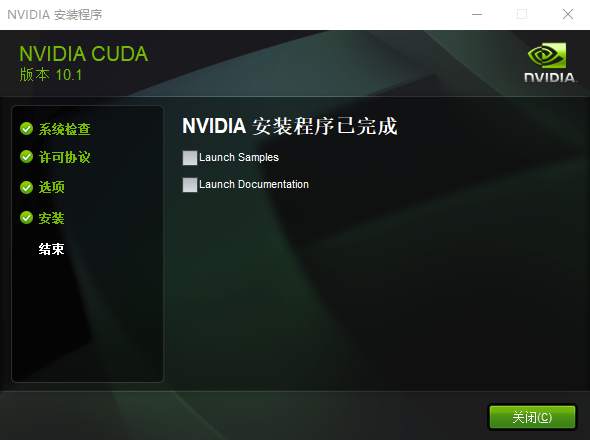

# PyTorch 环境准备
## 1. 开发环境
<table>
  <thead>
    <tr>
      <th align="center">#</th>
      <th align="center">Tool</th>
      <th align="center">Logo</th>
      <th align="center">Description</th>
    </tr>
  </thead>
  <tbody>
    <tr>
      <td align="center">1</td>
      <td align="center">Anaconda</td>
      <td align="center"><div align="center"></img></div></td>
      <td align="center">开源 Python 发行版</td>
    </tr>
    <tr>
      <td align="center">2</td>
      <td align="center">CUDA</td>
      <td align="center"><div align="center"></img></div></td>
      <td align="center">并行语言计算库</td>
    </tr>
    <tr>
      <td align="center">3</td>
      <td align="center">PyTorch</td>
      <td align="center"><div align="center"></img></div></td>
      <td align="center">深度学习框架</td>
    </tr>
    <tr>
      <td align="center">4</td>
      <td align="center">PyCharm</td>
      <td align="center"><div align="center"></img></div></td>
      <td align="center">Python 开发利器</td>
    </tr>
</table>


## 2. 开始安装
### 2.1 Anaconda
Anaconda 的下载地址：https://repo.anaconda.com/archive/Anaconda3-2019.07-Windows-x86_64.exe

下载完成后，双击运行安装。安装过程中，会提示你是否将 Anaconda 添加到环境变量，可以勾选，方便后面的操作。

安装完成后，可以在 Terminal 窗口运行：

```bash
>conda list
```

可以看到，conda 自带有很多包，包括 Python。

```bash
......
pysocks                   1.7.0                    py37_0    defaults
pytables                  3.4.4            py37he6f6034_0    defaults
pytest                    5.0.1                    py37_0    defaults
pytest-arraydiff          0.2              py37h39e3cac_0    defaults
pytest-astropy            0.4.0                    py37_0    defaults
pytest-doctestplus        0.1.3                    py37_0    defaults
pytest-openfiles          0.3.2                    py37_0    defaults
pytest-remotedata         0.3.2                    py37_0    defaults
python                    3.7.4                h5263a28_0    defaults
python-dateutil           2.8.0                    py37_0    defaults
python-libarchive-c       2.8                     py37_13    defaults
pytz                      2019.2                     py_0    defaults
pywavelets                1.0.0            py37h452e1ab_0    defaults
pywin32                   223              py37hfa6e2cd_1    defaults
......
```

输入 `conda -V` 命令查看当前版本：

```bash
>conda -V
conda 4.7.11
```

命令成功执行，说明 Anaconda 安装好了。

### 2.2 CUDA
接下来我们安装 CUDA。

**注意**，CUDA 执行运行在 NVIDIA 显卡上，因此，在进行 DeepLearning 学习的时候，请确保有一张 NVIDIA 显卡。

我们在装有 NVIDA 显卡的电脑上安装 NVIDA 显卡驱动以及统一的并行语言计算库 `CUDA 10.1`，通过利用 CUDA 提供的 API，可以很方便地调用硬件资源进行并行计算。

CUDA 的下载地址：https://developer.nvidia.com/cuda-downloads

根据本机，选择对应的操作系统，下载 local `.exe` 文件即可。比如我下载的是：http://developer.download.nvidia.com/compute/cuda/10.1/Prod/local_installers/cuda_10.1.243_426.00_win10.exe

下载完成后，双击运行进行安装。

安装完成效果图如下：



CUDA 默认安装在 `C:\Program Files\NVIDIA GPU Computing Toolkit\CUDA` 路径下，把 `C:\Program Files\NVIDIA GPU Computing Toolkit\CUDA\v10.1\bin` 添加到系统环境变量之后，执行 `nvcc -V` 命令，

```bash
>nvcc -V
nvcc: NVIDIA (R) Cuda compiler driver
Copyright (c) 2005-2019 NVIDIA Corporation
Built on Sun_Jul_28_19:12:52_Pacific_Daylight_Time_2019
Cuda compilation tools, release 10.1, V10.1.243
```

以上说明 CUDA 已成功安装。


### 2.3 PyTorch
接下来安装 PyTorch。

到 PyTorch 官网：https://pytorch.org/

目前 PyTorch 最新稳定版本是 v1.2，根据本机选择对应的版本，PyTorch 会生成一条命令。比如：

```bash
conda install pytorch torchvision cudatoolkit=10.0 -c pytorch
```

我们在系统中**以管理员身份运行**（重要！） Terminal，执行上面的命令进行安装。

第一次安装 pytorch 可能会出现 `HTTP 000` 连接失败的报错信息：

```bash
CondaHTTPError: HTTP 000 CONNECTION FAILED for url <https://conda.anaconda.org/pytorch/win-64/pytorch-1.2.0-py3.7_cuda100_cudnn7_1.tar.bz2>
Elapsed: -

An HTTP error occurred when trying to retrieve this URL.
HTTP errors are often intermittent, and a simple retry will get you on your way.

CondaHTTPError: HTTP 000 CONNECTION FAILED for url <https://conda.anaconda.org/pytorch/win-64/torchvision-0.4.0-py37_cu100.tar.bz2>
Elapsed: -

An HTTP error occurred when trying to retrieve this URL.
HTTP errors are often intermittent, and a simple retry will get you on your way.
```

这是因为在 conda 安装好之后，默认的镜像是官方的，由于官网的镜像在境外，访问太慢或者不能访问，为了能够加快访问的速度，我们重新配置清华的的镜像。

在 Terminal 窗口执行以下三条命令：

```bash
conda config --add channels https://mirrors.ustc.edu.cn/anaconda/pkgs/free/
conda config --add channels https://mirrors.tuna.tsinghua.edu.cn/anaconda/cloud/conda-forge/
conda config --add channels https://mirrors.tuna.tsinghua.edu.cn/anaconda/pkgs/free/
conda config --set show_channel_urls yes
```

再次执行 pytorch 的 install 命令，这里还可能报同样的错误，我们打开系统的 `.condarc` 文件，将文件内容修改为：

```bash
channels:
  -https://mirrors.tuna.tsinghua.edu.cn/anaconda/pkgs/main/
  - https://mirrors.tuna.tsinghua.edu.cn/anaconda/cloud/bioconda/
show_channel_urls: true
```

保存之后，重新执行 PyTorch 的 install 命令，这次应该是能成功了：

```bash
Downloading and Extracting Packages
ninja-1.9.0          | 238 KB    | ############################################################################ | 100%
pyreadline-2.1       | 143 KB    | ############################################################################ | 100%
distributed-1.28.1   | 841 KB    | ############################################################################ | 100%
pytorch-1.2.0        | 479.3 MB  | ############################################################################ | 100%
torchvision-0.4.0    | 2.3 MB    | ############################################################################ | 100%
cudatoolkit-10.0.130 | 250.0 MB  | ############################################################################ | 100%
powershell_shortcut- | 259 KB    | ############################################################################ | 100%
mock-3.0.5           | 49 KB     | ############################################################################ | 100%
anaconda-custom      | 3 KB      | ############################################################################ | 100%
_anaconda_depends-20 | 6 KB      | ############################################################################ | 100%
pytables-3.5.2       | 2.2 MB    | ############################################################################ | 100%
llvmlite-0.24.0      | 7.7 MB    | ############################################################################ | 100%
dask-core-0.19.1     | 1.0 MB    | ############################################################################ | 100%
h5py-2.9.0           | 779 KB    | ############################################################################ | 100%
Preparing transaction: done
Verifying transaction: done
Executing transaction: | DEBUG menuinst_win32:__init__(199): Menu: name: 'Anaconda${PY_VER} ${PLATFORM}', prefix: 'C:\Users\user\Anaconda3', env_name: 'None', mode: 'user', used_mode: 'user'
DEBUG menuinst_win32:create(323): Shortcut cmd is %windir%\System32\WindowsPowerShell\v1.0\powershell.exe, args are ['-ExecutionPolicy', 'ByPass', '-NoExit', '-Command', '"& \'C:\\Users\\user\\Anaconda3\\shell\\condabin\\conda-hook.ps1\' ; conda activate \'C:\\Users\\user\\Anaconda3\' "']
done
```

### 2.4 PyCharm
PyCharm 的下载请到：http://www.jetbrains.com/pycharm/download 页面。官方提供了 `Professional` 收费版和 `Community` 免费版，可以选择 `Community` 版本，之后下载安装即可。


## 3. PyTorch 试运行
我们在 PyCharm 中新建一个 Python 项目,命名随意，比如 `pytorch-practice`，在 `Existing Interpreter` 中浏览目录，选择 `Conda Environment`，在右侧 `Interpreter` 中继续浏览目录，选择 `Anaconda` 中的 `python.exe` 文件，`ok` 即可创建新项目。


