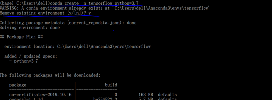
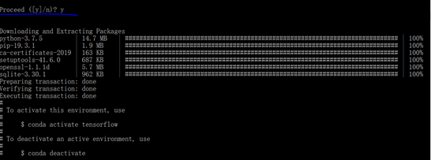

# TensorFlow 环境准备

请完整看完本文之后再进行操作，这样可以避免以下环境安装过程中遇到的一些坑。

## 1. 开发环境

<table>
  <thead>
    <tr>
      <th align="center">#</th>
      <th align="center">Tool</th>
      <th align="center">Logo</th>
      <th align="center">Description</th>
    </tr>
  </thead>
  <tbody>
    <tr>
      <td align="center">1</td>
      <td align="center">Anaconda</td>
      <td align="center"><div align="center"></img></div></td>
      <td align="center">开源 Python 发行版</td>
    </tr>
    <tr>
      <td align="center">2</td>
      <td align="center">CUDA</td>
      <td align="center"><div align="center"></img></div></td>
      <td align="center">并行语言计算库</td>
    </tr>
    <tr>
      <td align="center">3</td>
      <td align="center">Tensorflow</td>
      <td align="center"><div align="center"></img></div></td>
      <td align="center">深度学习框架</td>
    </tr>
    <tr>
      <td align="center">4</td>
      <td align="center">PyCharm</td>
      <td align="center"><div align="center"></img></div></td>
      <td align="center">Python 开发利器</td>
    </tr>
</table>

## 2. 开始安装

### 2.1 Anaconda

Anaconda 的下载地址：https://repo.anaconda.com/archive/Anaconda3-2019.07-Windows-x86_64.exe

下载完成后，双击运行安装。安装过程中，会提示是否将 `Anaconda` 添加到环境变量，建议**勾选**，方便后面的操作。


安装完成后，在 cmd 窗口执行 `conda list`：

```bash
>conda list
```

可以看到，conda 自带有很多包，包括 Python。

```bash
......
pysocks                   1.7.0                    py37_0    defaults
pytables                  3.4.4            py37he6f6034_0    defaults
pytest                    5.0.1                    py37_0    defaults
pytest-arraydiff          0.2              py37h39e3cac_0    defaults
pytest-astropy            0.4.0                    py37_0    defaults
pytest-doctestplus        0.1.3                    py37_0    defaults
pytest-openfiles          0.3.2                    py37_0    defaults
pytest-remotedata         0.3.2                    py37_0    defaults
python                    3.7.4                h5263a28_0    defaults
python-dateutil           2.8.0                    py37_0    defaults
python-libarchive-c       2.8                     py37_13    defaults
pytz                      2019.2                     py_0    defaults
pywavelets                1.0.0            py37h452e1ab_0    defaults
pywin32                   223              py37hfa6e2cd_1    defaults
......
```

执行 `conda -V` 命令查看 conda 当前版本：

```bash
>conda -V
conda 4.7.11
```

命令成功执行，说明 Anaconda 安装好了。

### 2.2 CUDA

接下来我们安装 CUDA。

**注意**，CUDA 只能运行在 NVIDIA 显卡上，因此，在进行 `DeepLearning` 学习的时候，请确保有一张 NVIDIA 显卡。

我们在装有 NVIDIA 显卡的电脑上安装 NVIDIA 显卡驱动以及统一的并行语言计算库 `CUDA`，通过利用 CUDA 提供的 API，可以很方便地调用计算机硬件资源进行并行计算。

CUDA 的下载地址：https://developer.nvidia.com/cuda-downloads

根据自己本机，选中对应的操作系统，Installer Type 选择 `exe(local)`，下载即可。比如我下载的是 CUDA 10.0：https://developer.nvidia.com/compute/cuda/10.0/Prod/local_installers/cuda_10.0.130_411.31_win10


安装包有点大，2.1 个 G，下载完成后，双击运行进行安装。


CUDA 默认安装在 `C:\Program Files\NVIDIA GPU Computing Toolkit\CUDA` 路径下，安装完成后，把 `C:\Program Files\NVIDIA GPU Computing Toolkit\CUDA\v10.1\bin` 添加到系统环境变量之后，执行 `nvcc -V` 命令，

```bash
>nvcc -V
nvcc: NVIDIA (R) Cuda compiler driver
Copyright (c) 2005-2019 NVIDIA Corporation
Built on Sun_Jul_28_19:12:52_Pacific_Daylight_Time_2019
Cuda compilation tools, release 10.1, V10.1.243
```

以上说明 CUDA 已成功安装。

### 2.3 TensorFlow2

由于在 `conda` 安装好之后，默认的镜像是官方的，由于官方镜像在境外，访问太慢或者不能访问，为了加快访问的速度，可以重新配置为“清华”的镜像。

- 更改包的下载来源：您只需要在您的`conda`命令行中执行此命令便会轻松简单的将您的下载源更改为国内的清华源：

```bash
conda config --add channels http://mirros.tuna.tsinghua.edu.cn/pkgs/free
conda config --set show_channel_urls yes
```

接下来安装 TensorFlow。

如果您想查看更多的信息请您移步到到 TensorFlow 中国官网：https://tensorflow.google.cn/

目前 TensorFlow2 已经支持一个库覆盖 GPU + CPU + TPU 的同时实现，所以您只需要安装 TensorFlow 这一个包即可使用 TPU/GPU/CPU 进行网络搭建和神经网络训练。

- 接下来您需要创建虚拟环境用来（当然如果您想的话）：

  (里是创建一个名字为 tensorflow,python 版本为 3.7 的虚拟环境用来安装 tensorflow)

```bash
conda create -n tensorflow python=3.7 # 这里的tensorflow是您的环境名称，python后面的的是您创建的tensorflow的虚拟环境的python的版本
```

- 接下来就按照步骤进行环境的配置，如果弹出选项选择 y 即可





- 激活您的虚拟环境，并安装 tensorflow

```
activate tensorflow #这里的tensorflow是您创建的虚拟环境的名称
pip install tensorflow # 安装tensorflow主体
```

### 2.4 PyCharm

PyCharm 的下载请到：http://www.jetbrains.com/pycharm/download 页面。官方提供了 `Professional` 收费版和 `Community` 免费版，可以选择 `Community` 版本，之后下载安装即可。

## 3. TensorFlow 试运行

我们在 PyCharm 中新建一个 Python 项目，命名随意，比如 `Tensorflow-practice`，在 `Existing Interpreter` 中点击 `...` 浏览目录，选择 `Conda Environment`，在右侧 `Interpreter` 中继续浏览目录，选择 `Anaconda` 中的 `python.exe` 文件，`ok` 即可创建新项目。

在项目下新建 `main.py` 文件：

```python
import tensorflow

print("TF's Version: ", tensorflow.__version__)
# 返回True或者False来验证您的设备是否支持GPU
device = tf.test.is_gpu_available()
print('Is gpu available?:{}'.format(device))
# 如果您的设备存在GPU则会输出True，与此同时也证明您的tensorflow环境安装完成
```

控制台打印出以下信息：

```bash
TF's Version:  2.8.0
Is gpu available?: True
```

- 如果您想查看 Tensorflow 对 GPU 的支持情况请参照 TensorFlow 官方的 GPU 支持:https://tensorflow.google.cn/install/gpu

最后祝您使用愉快！！

## 4. 总结

- 使用 Anaconda，可以在 `.condarc` 下修改镜像源，或者直接使用其他工具提升包下载速度。
- CUDA 的安装，首先应该查看本机显卡驱动的版本号，之后再到 CUDA 官网选择对应的版本下载并安装。

## 5. 参考资料

- [Tensorflow Start install](https://tensorflow.google.cn/install)
- [清华大学 Anaconda 镜像使用帮助](https://mirror.tuna.tsinghua.edu.cn/help/anaconda/)
